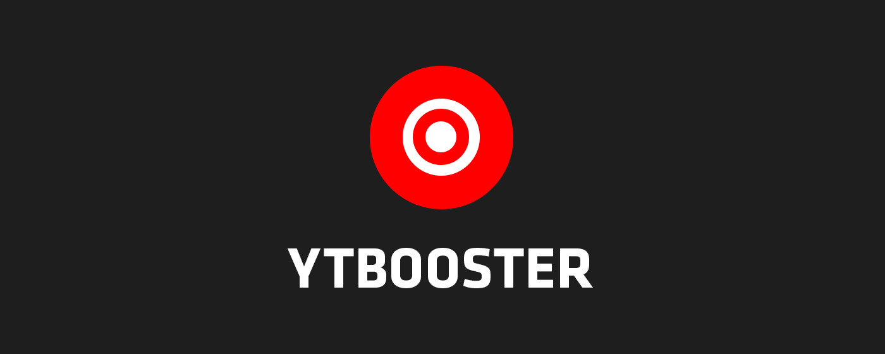
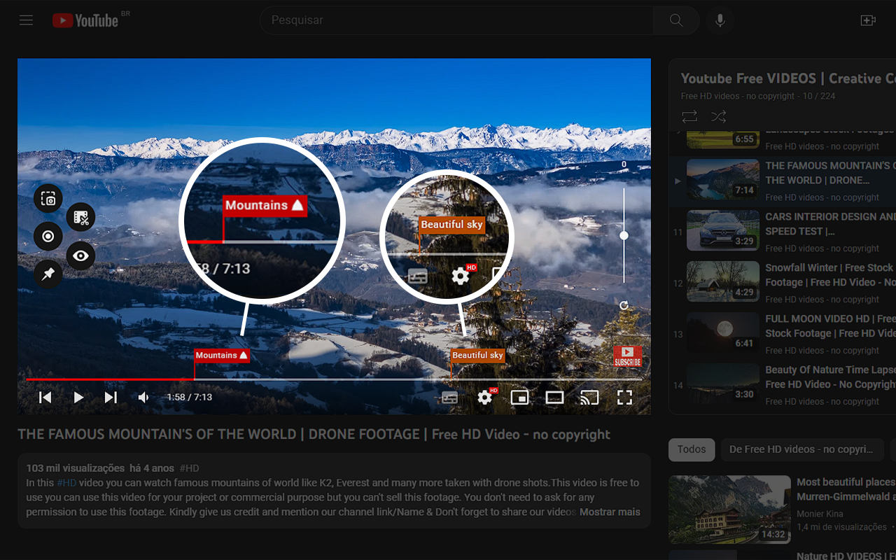
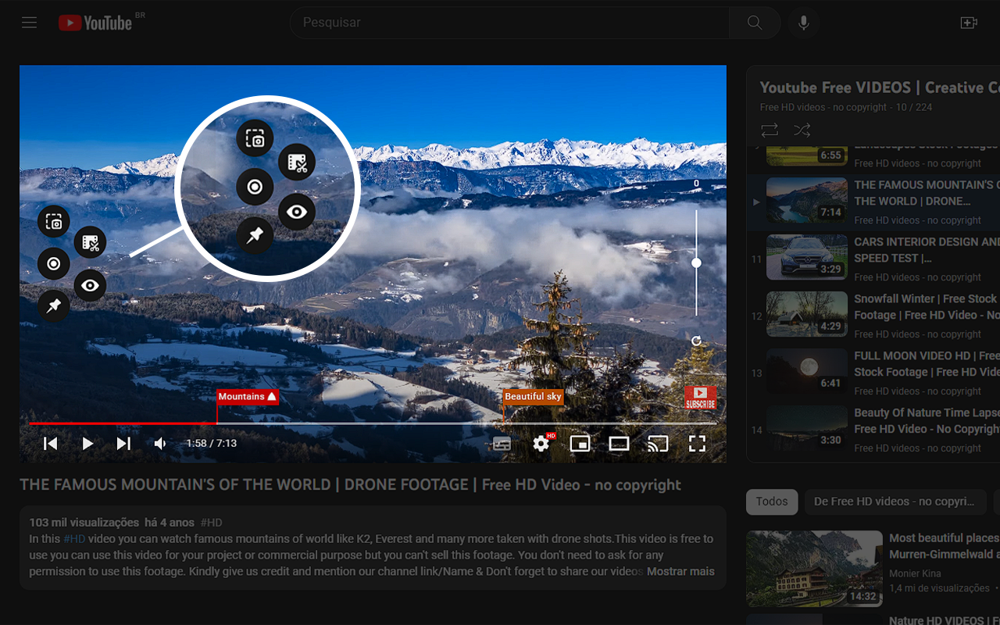
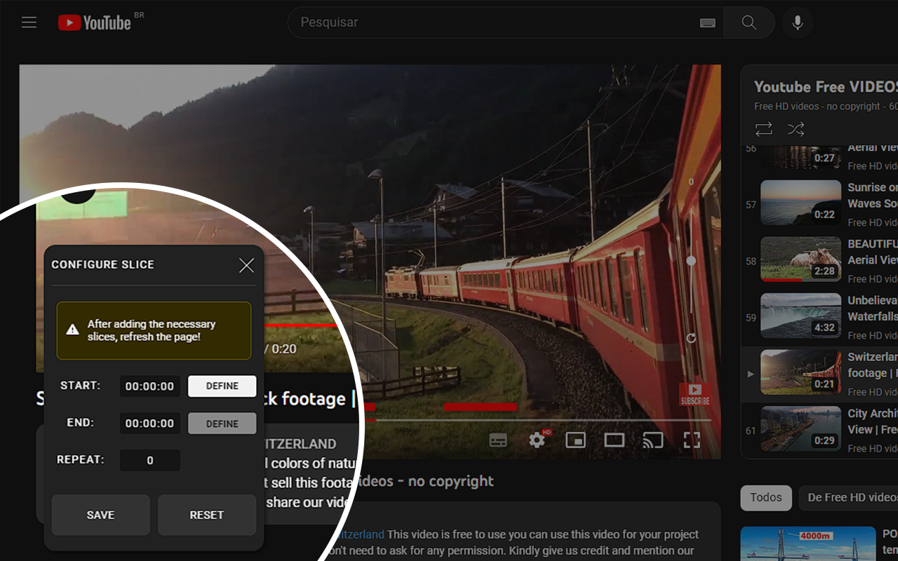
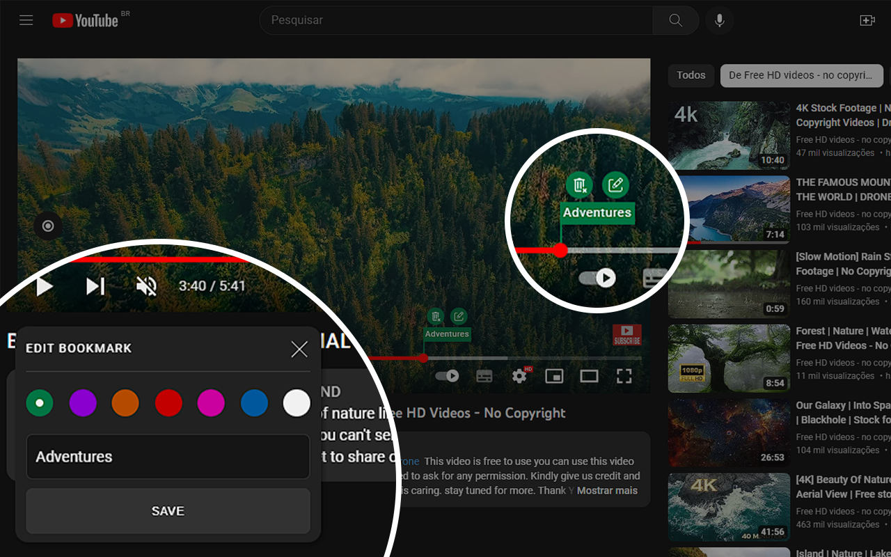

  

<h2 style="border-bottom:none;">About</h2>

Create custom YouTube video bookmarks, learn something new using snippets of replays, eliminate distraction, take video screenshots and much more with YT Booster extension.

<h3>Features:</h3>

- Create video markers to easily locate desired moments
- Customize markers with colors and descriptions
- Create video clips by selecting beginning and end
- Repeat video clips as many times as desired
- Take screenshots to capture images of video with same quality as video configuration
- Hide page distractions using Focus Mode and concentrate solely on the video
- Improve productivity when watching videos
- Facilitate locating important information using markers
- Organize and memorize information in videos

<h2 style="border-bottom:none;">Live preview</h2>

Mozilla Firefox Store (Add-ons): [https://addons.mozilla.org/pt-BR/firefox/addon/ytbooster/](https://addons.mozilla.org/pt-BR/firefox/addon/ytbooster/)

<h2 style="border-bottom:none; padding-top: 16px;">Screenshots</h2>

<h2 style="border-bottom:none;">Technologies and Tools</h2>

<h3>- Front-end</h3>

- [Vue.js](https://vuejs.org/)
- [Vuex](https://vuex.vuejs.org/)
- [Vue Router](https://router.vuejs.org/)
- [Sass (SCSS)](https://sass-lang.com/)

<h2>Contact me</h2>

- [Linkedin](https://www.linkedin.com/in/gregorydom/)
- [Github](https://github.com/gregdom)
